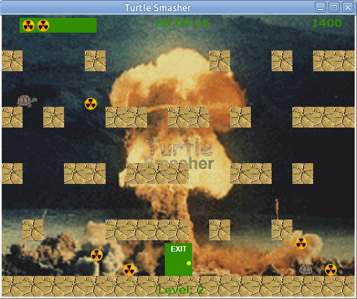

# Turtle Smasher

A game that's inspired by Super Mario Bros. 3's Battle Mode.
The implementation is janky, from 2005, when Java applets were still a thing.




## Usage

### Download
```bash
git clone https://github.com/mm318/turtle-smasher.git
```

### Build
```bash
# under the turtle-smasher/ directory
javac GameGui.java
```

### Run
Requires that the build step has been completed beforehand
```bash
# under the turtle-smasher/ directory
java GameGui
```

(Tested on Ubuntu 20.04 with OpenJDK 17.)
